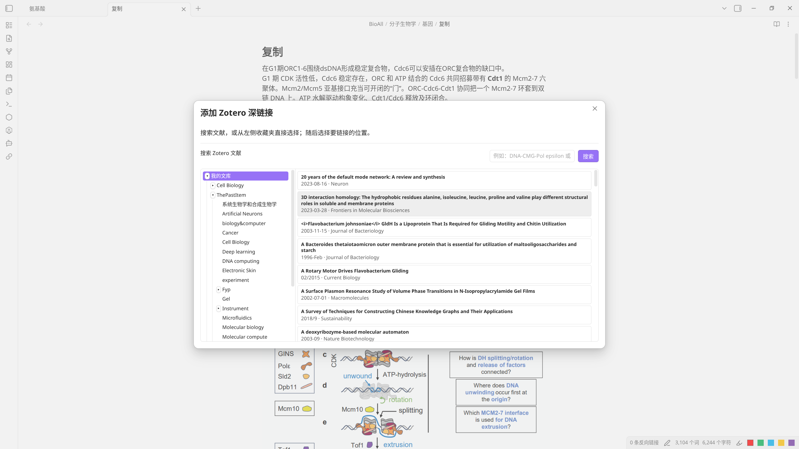

# Zotero Deep Linker for Obsidian

[中文版](README_zh.md) | English

An Obsidian desktop plugin that searches the local Zotero library and inserts
Markdown links to a bibliographic item, a PDF attachment, or one specific PDF
annotation.



## Use

1. Keep Zotero running and enable **Settings → Advanced → API → Enable local API** (default port **23119**, i.e. `http://127.0.0.1:23119`).
2. In an Obsidian Markdown note, run **Zotero Deep Linker: Add Zotero Deep Link**
   from the command palette, or use the chain-link ribbon button.
3. Search by title, author, DOI, or keyword, or select a Zotero collection in
   the tree beside the results to browse it directly. Both are available in the
   same window.
4. Choose **Item**, or choose a **PDF** and then a concrete **Annotation**.

The inserted targets have these forms:

```markdown
[Zotero Item](zotero://select/library/items/ITEM_KEY)
[Open PDF](zotero://open-pdf/library/items/PDF_KEY)
[Open PDF Annotation](zotero://open-pdf/library/items/PDF_KEY?page=PAGE&annotation=ANNOTATION_KEY)
```

The plugin never changes Zotero items, PDFs, or annotations. It only reads the
local API and inserts a link into the current Obsidian editor.

## Requirements

- **Obsidian ≥ 1.8.0** (desktop only)
- **Zotero desktop running** with **Local API enabled**  
  (`Settings → Advanced → API → Enable local API`, default `http://127.0.0.1:23119`)
- **No other Obsidian plugins required**
- **No Zotero plugins/extensions required**

## Settings

The default Zotero Local API address is `http://127.0.0.1:23119`. Change it
from **Settings → Community plugins → Zotero Deep Linker** only if your Zotero
setup uses a different local address.

The same settings page includes **Collection Column Min Width**. Its default is 150 px and it
can be increased when your collection names are longer.

## Language

UI language follows Obsidian's language setting:
- English (default)
- Chinese (when Obsidian language is set to Chinese)

## Development

```bash
npm install
npm run build
```

## License

GPL-3.0